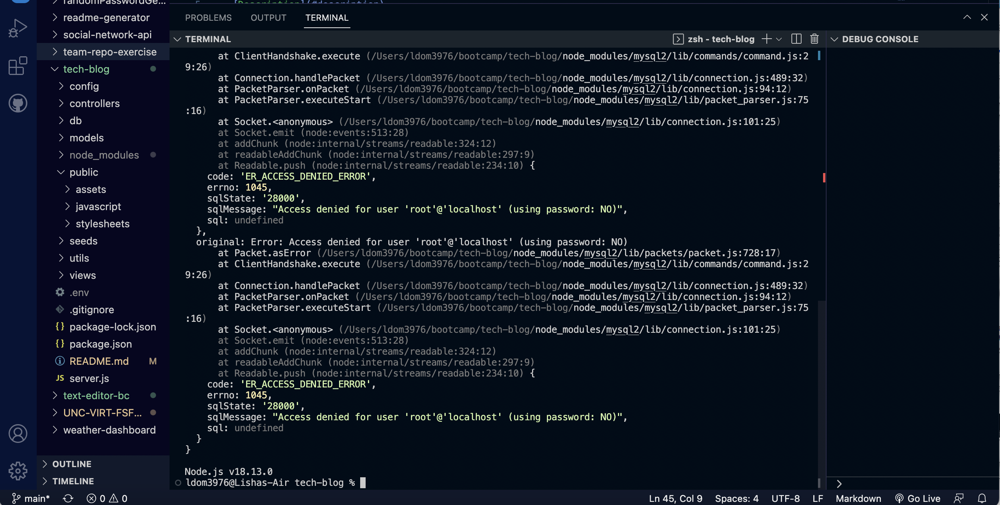

# Tech Blog

## Table of Contents
- [User Story](#user-story)  
- [Description](#description)  
- [Installation](#installation)  
- [Deployed Application](#deployed-application)
- [Visual Representation](#visual-representation)
- [Contributing](#contributing) 
- [Links](#links)

## Note to Graders:

## User Story

`AS A developer who writes about tech
I WANT a CMS-style blog site
SO THAT I can publish articles, blog posts, and my thoughts and opinions`

## Description

This is a blog website where the user may sign up or log in, then they are able to create posts, add comments, view, edit and delete their posts as well as comment on other user's posts. This application uses node.js, express, sequelize, mysql and handlebars.

## Installation

- Download through GitHub
- Run `npm install` to install dependencies
- Change your password in the .env file
- Run `mysql -u root -p` in the terminal
- Type `SOURCE db/schema.sql` to source the database
- Type `npm run seed` in the terminal to intall seeds.
- Start the server by running `npm run start`.

## Deployed Application

link here

## Visual Representation

## Contributing

- Most code and file/folder structure in this project is from HW Boilerplate given to us through UNC Chapel Hill Coding Bootcamp
- Some code is referenced from past UNC Chapel Hill Coding Bootcamp curriculum

## Links

- [Elisha Ballard](https://www.github.com/ldom3976)  